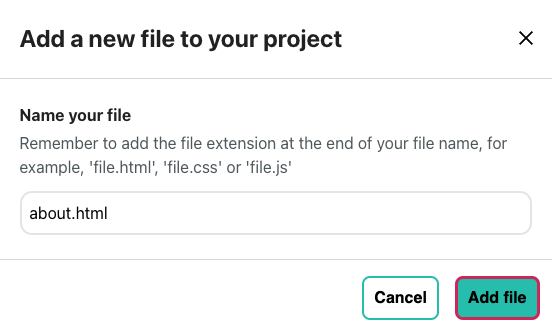

<h2 class="c-project-heading--task">Adding a file in the Editor</h2>

Add a new file to your project in the Editor.

<h2 class="c-project-heading--explainer">Follow these instructions</h2>

**Click** the '+ Add file' button.

Name your new file (e.g. `about.html`) and click the 'Add file' button.

## Now run your code

Check that your file appears in the 'Project files' list on the left.

