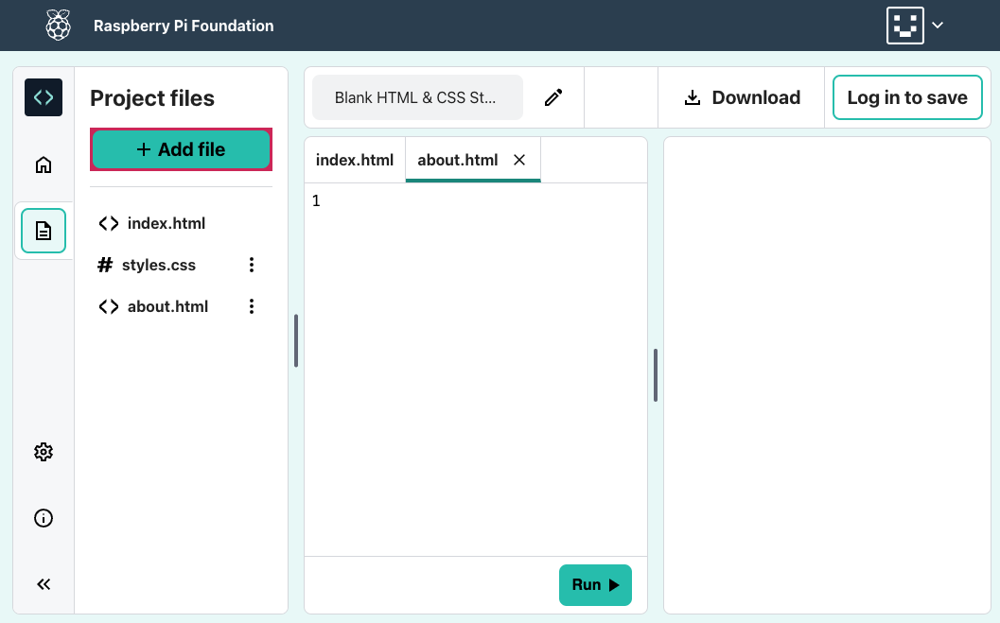

**Klik:** op de knop **+ Add file**.

Geef jouw nieuwe bestand een naam (bijv. `about.html`) en klik op de knop **Add file**.

Je bestand wordt weergegeven in de lijst 'Project files' aan de linkerkant.

